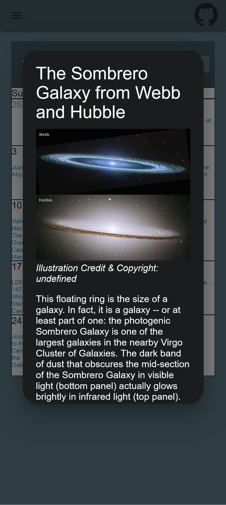

# Astronomy Picture of the Day

A project made using the NASA apod api. You can see the picture of the day, a random picture, and a calendar to see the past pictures of the day. Discover the cosmos!

## Table of Contents

- [Contributing](#contributing)
- [License](#license)

## Contributing
Contributions are welcome! Please open an issue or submit a pull request for any changes.

## License
This project is licensed under the MIT License. See the [LICENSE](LICENSE) file for details.